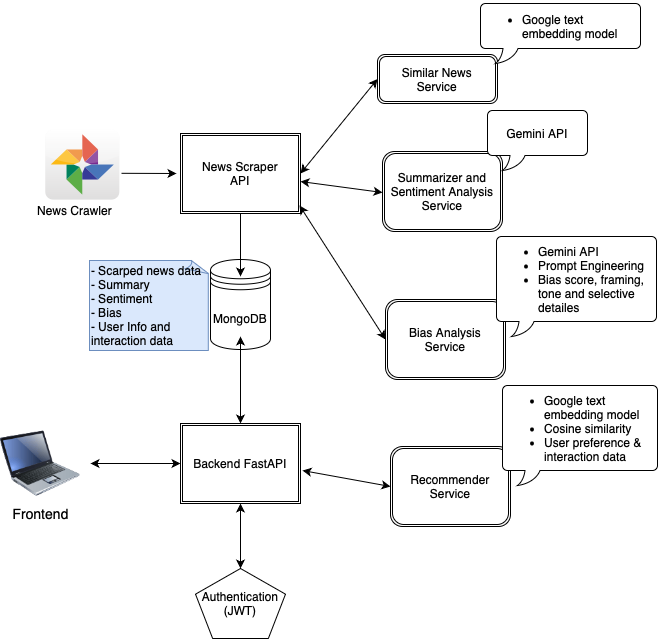

# GenAI-Powered News Portal

## Overview
This is a news aggregation service that collects news from multiple sources and provides users with the following features:

- **News Summarization**: Generate concise summaries of news articles.  
- **Personalized Recommendations**: Suggest news tailored to user preferences.  
- **Related News Suggestions**: Highlight related news articles to provide context.  
- **Sentiment Analysis**: Analyze the tone of news content (Positive, Negative, Neutral).  

## Architecture

## Core Features
- **Crawling and Scraping**: Collect news URLs, metadata, and content from multiple sources.  
- **Database Storage**: Store structured news data in MongoDB.  
- **Embedding Generation**: Use the Gemini API to create semantic embeddings for news items.  
- **API Services**: Provide APIs for accessing news-related functionalities through FastAPI.  
- **Microservice Deployment**: Deploy the project as a Dockerized microservice architecture.  

---

## Project Structure

1. **`crawler_pipeline`**  
   - Crawls news portals and collects metadata such as URLs and publication dates.  
   - Designed to run on a schedule (e.g., daily, hourly).  

2. **`scraper_pipeline`**  
   - Scrapes data from crawled URLs and processes the content. Key components:  
     - **`bias_analyzer`**: Analyzes content for potential biases, mimicking subject expert evaluations.  
     - **`classification`**: Categorizes news into predefined topics (e.g., Politics, Crime, International, Sports).  
     - **`constants`**: Defines reusable constants used throughout the pipeline.  
     - **`database`**: Handles database operations like queries, inserts, and vector searches.  
     - **`embedding`**: Generates embeddings to enable semantic search functionality.  
     - **`sentiment`**: Performs sentiment analysis to classify news tone.  
     - **`summary`**: Summarizes news content into concise formats.  

3. **`news_api`**  
   - Provides API endpoints for accessing news content:  
     - Random news  
     - Latest news  

---

## Tech Stack

- **Backend**: Python, FastAPI  
- **Database**: MongoDB  
- **Generative AI**: Gemini Embedding API, Gemini Generative API  
- **Containerization**: Docker  
- **Deployment**: AWS EC2, Azure App Service  
